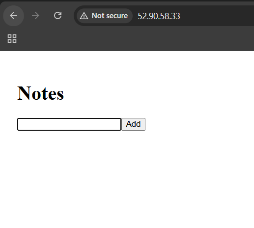

Notes App – Deployment Guide
This project includes a backend (Node.js + Express) and a frontend (React), both dockerized and managed with Docker Compose.
The app is built and deployed automatically via a CI/CD pipeline in GitHub Actions.

Requirements
A Linux server (e.g., Ubuntu) with SSH access

Docker installed

Docker Compose installed

Firewall/Security Group rules allowing:

Port 80 – frontend

Port 5000 – backend

How Deployment Works
Deployment is fully automated through GitHub Actions:

CI Stage (Build & Push)

Check out the code

Install dependencies (npm install)

Build the frontend

Create Docker images for frontend and backend

Push images to Docker Hub (shirelchaulker/{frontend|backend})

CD Stage (Deploy)

Connect to the VM via SSH

Run docker-compose pull to fetch the latest images from Docker Hub

Restart containers using docker-compose up -d --remove-orphans

Running the App on the VM
You do not build the app locally on the VM.
The CI workflow handles the build process and uploads the images to Docker Hub.

On the VM, make sure:

You have a project folder containing the correct docker-compose.yml

You run:

bash
Copy
Edit
docker-compose pull
docker-compose up -d --remove-orphans
CI/CD Pipeline Overview
Trigger: Runs automatically on every push to the main branch

CI: Builds and pushes Docker images

CD: Pulls updated images on the VM and restarts containers

Prerequisites
Before the workflow can run successfully:

On the VM: Docker + Docker Compose installed

On GitHub: The following repository secrets set:

DOCKER_USERNAME

DOCKER_PASSWORD (or access token)

VM_HOST

VM_USER

VM_SSH_KEY (private SSH key)

## Screenshots

### Notes app running in browser

### Docker containers running on VM

